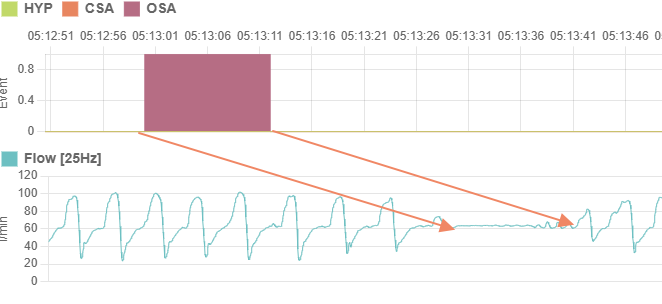

## The *.USR* File (Machine info, settings and sessions)
The USR seems to be considered the main file to start with. When using PAP Link PC, the File Open dialog filter is set to `.USR`, and when opening a folder with only a `.USR` file, session information is displayed. 
 

## A note about sessions and respiratory events
BMC considers a day to run from noon to tomorrow at noon. They record the current (in-progress) session at a fixed location early in the file, and every day at noon, this session is processed and appended to the end of the file. A new session then starts overwriting the current session. The data format for the current session is different to the historical session data format.
 
Sessions stored in this file contain information about the start date and time, pressure changes and respiratory events. 
The USR file is the only file in which respiratory events are stored. Timestamps are only stored at 1  minute granularity. Pressure change durations are recorded to 1 minute granularity and respiratory event durations are recorded to 1 second granularity. Since pressure information is already recorded at higher resolution in the `.nnn` waveform files, these aren't really important.  
Unfortunately, when it comes to respiratory events, the timestamp at which it occured is only recorded to the minute (e.g. 01:34). The duration is recorded in seconds. The result of this is that when plotting charts, the identified respiratory event will not overlay precisely onto the flow measurement for instance, but it will be close enough. To illustrate, in this plot, there is an OSA event recorded but it's timestamp is at 05:13:00 (because seconds aren't stored) even though the actual event is around 05:13:28. The duration is correct. What we expect then is that respiratory events are recorded as the total duration that they occured for in one minute discrete intervals.
 

## Contents of the .USR file

Looking broadly over the file, the following areas have been identified
|Offset Hex|Description|
|---------|----------|
|`0x0000`|Information about the machine such as serial number, model number and firmware version.  Offset `0x1C` has value `0x42e` which might just mean the offset for the in-current session|
|`0x022e`|There appears to be a number of null-terminated strings in this region representing patient information. Likely PAP Link PC sets this data. The data is preceeded by `0xF2` and is 512 bytes long|
|`0x042e`|The in-progress session. As mentioned above, this would be data between noon and the next day noon. The data format is different to historical sessions.  Data is preceeded by `0xF4` and indeterminate length, but followed by large block of `0xff` bytes|
|`0x2242`|Machine settings are perhaps stored here. Importantly a null-terminated string of the model number is location at `0x225e`.  Data is preceeded by `0xF7` and indeterminate length, but followed by large block of `0xff` bytes|
|`0x102338`|Machine settings are perhaps stored here. Importantly a null-terminated string of the model number is location at `0x225e`.  Data is preceeded by `0xF1`. Session packets are of variable length until end of file|

 

## Machine info (Offset 0x00)
Not much is known about this section.
Useful information found:
|Offset Hex|Description|
|---------|----------|
|`0x001c`|Possibly the uint32 offset in this file where the current session is recorded|
|`0x002d`|A null-terminated string (max length 32) containing the serial number of the machine. There is space padding at the start so the offset might be `0x35`. The last 8 characters of the serial number is used for filenames|

 

## Patient info (Offset 0x22e)
Not much is known about this section.

 

## Machine settings (Offset 0x2242)
Not much is known about this section.
Useful information found:
|Offset Hex|Description|
|---------|----------|
|`0x2296`|The model name of the machine as a null-terminated string|

 

## In-progress session (Offset 0x42e)
This section stored information about the session between the last noon and the coming noon. Each day at noon, this section is processed and appended to the historical session section at the end of the file. The data format is different to historical sessions.

|Offset Hex|Description|
|---------|----------|
|`0x431`|The uint16 [encoded date](0a-date-encoding.md) when this session starts |
|`0x441`|The start of messages with semi-known structure |

Messages starting from offset `0x441` follow this format: 
|Length|Description|
|---------|----------|
|1|Message Type |
|1|Length of message payload in bytes|
|n|Payload bytes|

The only message not following the above format is `0x02` which has this format
|Length|Description|
|---------|----------|
|1|Message Type == `0x02`. This message represent a pressure change in cmH20*2|
|3|Three bytes of data: `Pressure x2`, `Minutes at this pressure`, `Unknown`|

Known message types are
|Message Type|Description|Payload|
|---------|----------|---|
|`0xff`|End of data ||
|`0x07`|CSA Event|`Offset 0`: `Number of hours since noon` `Offset 1`: `Minute in hour` `Offset 2`: `Duration of events in seconds`|
|`0x08`|OSA Event|Same as above|
|`0x09`|HYP Event|Same as above|

 
 

#### Historical Sessions (Offset 0x102338)
All sessions recorded by the machine are stored here except the current session in progress, i.e. everything up until the last noon is recorded from here on out. 
|Offset Hex|Description|
|---------|----------|
|`0x102338`|The number of sessions to follow (uint16, but possibly uint32)  |
|`0x102340`|The start of historical sessions data, each starting with `0xE1` and possibly ends with `0x87 00 00 00 00`|

Historical sessions format: Offsets are relative to the start of the session.

|Offset|Length|Description|
|---------|----------|---|
|0x00|uint8|Header equal to `0xE1`|
|0x07|uint16|The uint16 [encoded date](0a-date-encoding.md) when this session starts|
|0x0F|uint16|The session duration in minutes|
|0x45|Variable|Messages of unknown meaning (possibly stats) following the format  `uint8t Message Type` `uint16_t Data Byte 1` `uint16_t Data Byte 2` We read using this method until we get a Message Type of `0xff` and two data bytes of `0xff` each. The message type in this block are from `0x81` to `0x87` but I haven't been able to decipher their meaning|
|Follows after `0xff ffff ffff`|Variable|Session Data Messages `uint8: Message Type (observed to be between 0x80 and 0x8f)` `uint16: Count of payload for message` `uint16: 0x0000` `Session Data Message Payload follows, explained in next table`|

The session data messages, have different payload formats and length according to what the message represents:

**Session Data Message Payload**
|Message Type|Description|
|----|----|
|`0x86` or `0x82`|Array of `uint32` integers of length given in session data message i.e. `uint32[payloadCount]`|
|`0x83` or `0x84` or `0x85`|Arrays of 3 bytes each, of length payload length, each representing a respiratory event. i.e. `uint8[payloadCount][3]` Message Type `0x83: OSA`, `0x84: HYP`, `0x85: CSA` `msg[i][0]: Hours since noon` `msg[i][1]: Minute in hour` `msg[i][2]: Duration in seconds`|
|All others|Array of `uint16` integers of length given in session data message i.e. `uint16[payloadCount]`|

