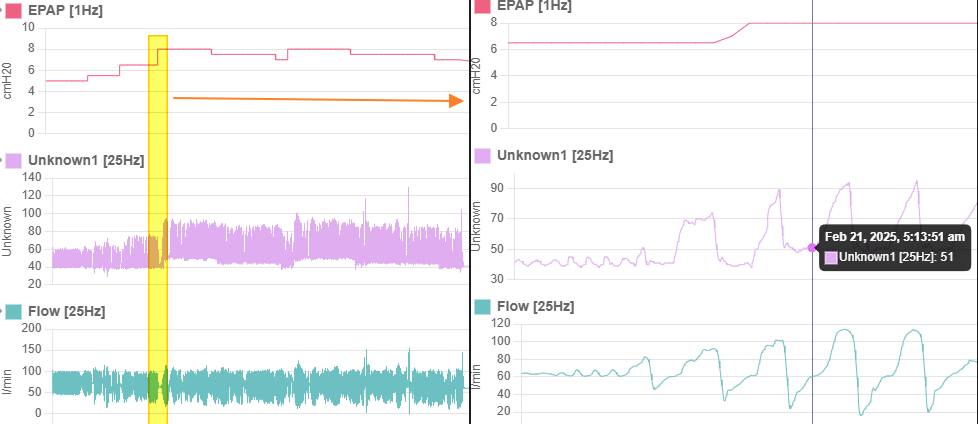
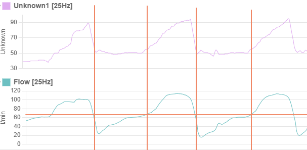
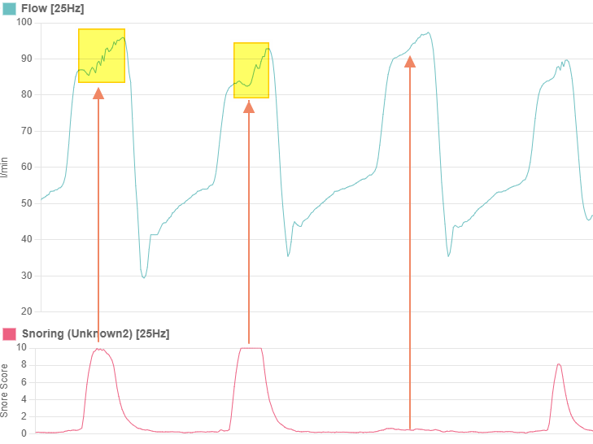
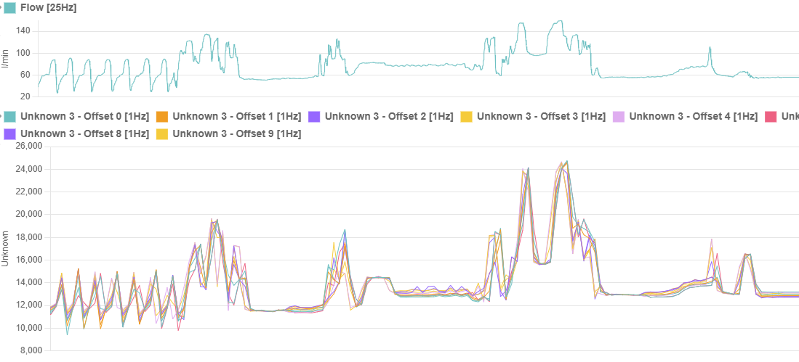

## Waveforms in the `.nnn` file packet

With reference to the [.nnn file document](02-nnnfile.md)

I welcome any feedback on the below or any insights you may have into the waveforms. There is a Github issue created that makes it easy for anyone to post: [https://github.com/riaancillie/BmcCpapData/issues/1](https://github.com/riaancillie/BmcCpapData/issues/1)

#### Offset `0x0004` - 1Hz - IPAP
The waveform is most like IPAP. It's low resolution conforms to other manufacturer's data logging. Since BMC pressure granularity is 0.5 cmh20, the raw value is doubled to become an integer. 

#### Offset `0x0006` - 1Hz - EPAP
The waveform is most like EPAP. It's low resolution conforms to other manufacturer's data logging. Since BMC pressure granularity is 0.5 cmh20, the raw value is doubled to become an integer. 

#### Offset `0x0008` - 25Hz - Unknown 1
The waveform follows both the flow rate and pressure changes. This narrows down the likely measurement representation. In the image below,  a change in pressure from 6.5 to 8 cmH20 corresponds to a increase in the baseline/median of the waveform from about 40 to about about 50. This potentially indicates a ratio of 0.15 to map the raw value to an actual pressure. When applying this ratio to our raw values of 40 and 50, we get a mapped value of 6 and 7.5 respectively, which is 0.5 cmH20 below our recorded pressue changes.



Another observation is that this waveform forms sharp peaks that coincide with the inhalation phase of flow, and forms plateus during the exhalation phase of flow. 



Given the high resolution measurement, the leading candidate for this waveform is likely **mask pressure** but confirmation is required by an expert. 

#### Offset `0x003A` - 25Hz - Unknown 2
The waveform appears to be related to flow and does not follow pressure changes. It might be either flow limitations or snoring. 
When inspecting the raw data over several sessions, it appears the lower limit of the raw value ranges between sessions but is generally between 344 and 346. The highest value recorded is consistently 1023 across all sessions. 



When comparing flow to this waveform focusing on on a very short inspection period, we can see that the waveform does not match the general expection of a flow limit plot. What we instead see is that minor fluctations in the flow are assigned a high value, and steady gradients in flow are assigned a low value. This is therefore most likely a measure of snoring. The unit of measure is unknown but is likely arbitraty. Given a max value of 1023, we apply a linear remapping of the value to more human readable value, e.g. a scale of 0 to 10. Further investigation from other recording (especially other users) will need to be used to determine a minimum value for remapping. 


#### 10x 1Hz Waveforms from `0x009E` to `0x00B4` - Unknown 3
There are 10 waveforms recorded at 1Hz that are almost identical to each other, with very minor devations between each. They all have a range in raw values of between 10 000 and 17 000 on average. We can see they closely follow flow rate, but also follow pressure changes. These might be some measure of some sensor or other in the CPAP. The raw values are also quite high and I'm not sure what useful measurement to the user would require such a dynamic range in raw values. 




#### 1Hz Waveform from `0x00B2` - Unknown 4 Offset 0
A 1hz waveform with very little variation. Raw values range from 1922 to 1944. It appears to follow flow rate, 


#### PAP Link
PAP Link PC provides XML internationalization language files. In the English language file, there is a list of all the possible charts. Note that some devices may show different charts, e.g. a BMC polysomnograph device would show snoring where as an xPAP device would probably not. 
```
	<item key="detail_chart_press_setup">Pressure Trend</item>
	<item key="detail_chart_press_epap">EPAP</item>
	<item key="detail_chart_press_ipap">IPAP</item>
	<item key="detail_chart_press_monitor">Pressure Wave</item>
	<item key="detail_chart_flow">Flow</item>
	<item key="detail_chart_insp_trigger_anomaly">Abnormal of inspiratory trigger</item>
	<item key="detail_chart_res_event">Respiratory Events</item>
	<item key="detail_chart_res_event_osa">OSA</item>
	<item key="detail_chart_res_event_csa">CSA</item>
	<item key="detail_chart_res_event_hyp">HYP</item>
	<item key="detail_chart_res_event_snore">Snore</item>
	<item key="detail_chart_tidal_volume_monitor">Monitored Tidal Volume</item>
	<item key="detail_chart_minute_ventilation">Minute Ventilation</item>
	<item key="detail_chart_insp_time">Inspiration Time</item>
	<item key="detail_chart_exp_insp_ratio">I/E Ratio</item>
	<item key="detail_chart_exp_insp_ratio_insp">Ins</item>
	<item key="detail_chart_exp_insp_ratio_exp">Exp</item>
	<item key="detail_chart_res_rate">Respiratory Rate</item>
	<item key="detail_chart_spo2">SpO2</item>
	<item key="detail_chart_pulse_rate">Pulse Rate</item>
	<item key="detail_chart_leak">Leak</item>
```