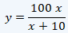

## Waveforms in the `.nnn` file packet


#### Foreword
With reference to the [.nnn file document](02-nnnfile.md)

I welcome any feedback on the below or any insights you may have into the waveforms. There is a Github issue created that makes it easy for anyone to post: [https://github.com/riaancillie/BmcCpapData/issues/1](https://github.com/riaancillie/BmcCpapData/issues/1)


#### Comparing known charts
PAP Link PC for the G3 A20 model only displays four plots
* Respiratory Events
* Pressure Trend (low resolution)
* Flow
* Leak

The software has a configuration file at `<Install Location\>BMC\PAP Link\Config\DeviceType.xml`. This file contains every model BMC manufactures which the software is capable of reading. Each device has a `TypeId` number. When changing this number for my model from `2` to `3`, the software plots several more charts including (additional to the above)
* Pressure Wave
* Monitored Tidal Volume
* Minute Ventilation
* Respiratory Rate
* Inspiration/Expiration Ratio

PAP Link also provides XML internationalization language files. In the English language file, there is a list of all the possible charts. Note that some devices may show different charts, e.g. a BMC polysomnograph device would show snoring where as an xPAP device would probably not. At least this narrows down the possible charts that are not displayed.

```
	<item key="detail_chart_press_setup">Pressure Trend</item>
	<item key="detail_chart_press_epap">EPAP</item>
	<item key="detail_chart_press_ipap">IPAP</item>
	<item key="detail_chart_press_monitor">Pressure Wave</item>
	<item key="detail_chart_flow">Flow</item>
	<item key="detail_chart_insp_trigger_anomaly">Abnormal of inspiratory trigger</item>
	<item key="detail_chart_res_event">Respiratory Events</item>
	<item key="detail_chart_res_event_osa">OSA</item>
	<item key="detail_chart_res_event_csa">CSA</item>
	<item key="detail_chart_res_event_hyp">HYP</item>
	<item key="detail_chart_res_event_snore">Snore</item>
	<item key="detail_chart_tidal_volume_monitor">Monitored Tidal Volume</item>
	<item key="detail_chart_minute_ventilation">Minute Ventilation</item>
	<item key="detail_chart_insp_time">Inspiration Time</item>
	<item key="detail_chart_exp_insp_ratio">I/E Ratio</item>
	<item key="detail_chart_exp_insp_ratio_insp">Ins</item>
	<item key="detail_chart_exp_insp_ratio_exp">Exp</item>
	<item key="detail_chart_res_rate">Respiratory Rate</item>
	<item key="detail_chart_spo2">SpO2</item>
	<item key="detail_chart_pulse_rate">Pulse Rate</item>
	<item key="detail_chart_leak">Leak</item>
```

### Waveforms found corresponding to PAP Link

#### Offset `0x0004` - 1Hz - IPAP
The raw uint16 value can be halved into a float to get the pressure in cmH20. Since BMC pressure granularity is 0.5 cmh20, the raw value is doubled to become an integer

#### Offset `0x0006` - 1Hz - EPAP
The raw uint16 value can be halved into a float to get the pressure in cmH20. Since BMC pressure granularity is 0.5 cmh20, the raw value is doubled to become an integer

#### Offset `0x0008` - 25Hz - Pressure Wave
This waveform corresponds to `Pressure Wave`. There are no units assigned to this plot and the gain displayed is 1:1.


#### Offset `0x00C6` - 1Hz -Tidal Volume
Raw value is tidal volume in milliliter/mL

#### Offset `0x00CA` - 1Hz - Minute Ventilation
Raw value is minute ventilation * 10 in Liter/Minute or LPM

#### Offset `0x00D0` - 1Hz - Respiratory Rate
Raw value is respiratory rate in breaths/minute or BPM

#### Offset `0x00C4` - 1Hz - Leak
Raw value is x10 the leak with unit "Liter/Min" or "LPM"

#### 1Hz - I/E Ratio
The raw value (anecdotally observed to be between 5 and 60) represent a value that is mapped to a percentage via a equation. The inspiration value in percentage form can be calculated as 

with x being the raw value, and y being the I (Inspiration) value as a percentage.

Written as an code expression: `InspirationPercentage = (100 * rawValue) / (rawValue + 10)`

Considering that we will be mapping thousands of raw values to percentages with the raw value being integers that range from 5 to 60, we can considerably boost performance using a lookup table that maps the raw value to the percentage

`mappedPercentages = [0, 9.1, 16.7, 23.1, 28.6, 33.3, ....]`

<br>
<br>

### Other Waveforms

#### Offset `0x003A` - 25Hz - Snoring
This waveform is not displayed in PAP Link.
The waveform appears to be related to flow and does not follow pressure changes. It might be either flow limitations or snoring. 
When inspecting the raw data over several sessions, it appears the lower limit of the raw value ranges between sessions but is generally between 344 and 346. The highest value recorded is consistently 1023 across all sessions. 


When comparing flow to this waveform focusing on on a very short inspection period, we can see that the waveform does not match the general expection of a flow limit plot. What we instead see is that minor fluctations in the flow are assigned a high value, and steady gradients in flow are assigned a low value. Clusters of high values in this plot correspond to an increase in pressure, and periods of low values in this plot correspond to a gradual decrease in pressure.

 This is therefore most likely a measure of snoring. The unit of measure is unknown but is likely arbitraty. Given a max value of 1023, we apply a linear remapping of the value to more human readable value, e.g. a scale of 0 to 10. Further investigation from other recording (especially other users) will need to be used to determine a minimum value for remapping. 


#### 10x 1Hz Waveforms from `0x009E` to `0x00B4` - Unknown 3
There are 10 waveforms recorded at 1Hz that are almost identical to each other, with very minor devations between each. They all have a range in raw values of between 10 000 and 17 000 on average. We can see they closely follow flow rate, but also follow pressure changes. These might be some measure of some sensor or other in the CPAP. The raw values are also quite high and I'm not sure what useful measurement to the user would require such a dynamic range in raw values. 


#### 1Hz Waveform from `0x00B2` - Unknown 4 Offset 0
A 1hz waveform with very little variation. Raw values range from 1922 to 1944. It appears to follow flow rate, 


