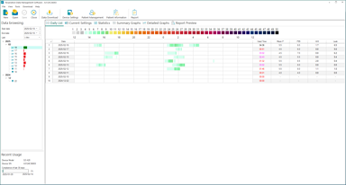

# BMC CPAP SD Card Data Deciphering

## Just here to see the pretty pictures? Have at it:
[Session 2025/02/21](https://riaancillie.github.io/BmcCpapData/?file=20250221)

[Session 2025/02/20](https://riaancillie.github.io/BmcCpapData/?file=20250220)

[Session 2025/02/19](https://riaancillie.github.io/BmcCpapData/?file=20250219)

[Session 2025/02/16](https://riaancillie.github.io/BmcCpapData/?file=20250219)

## What is this repository?
I was recently diagnosed with sleep apnea and selected the BMC G3 A20 APAP (sold in some markets as the Luna G3). I knew before making the purchase that the machine was not supported by [OSCAR](https://www.sleepfiles.com/OSCAR/), the de facto software used by almost everyone that wants to analyze and optomize their CPAP experience. 

My goal with this repository is to
- Document everything I discover as I start deciphering BMC's SD Card data 
- Hopefully reach a point where enough of the data format is understood to write a machine loader plugin for OSCAR so that BMC devices can finally be supported.

What I have determined so far is that the BMC stores a LOT of data, especially waveform data. Unlike ResMed, the data is purely binary and therefore doesn't leave a lot of clues. 

I haven't quite figured out which waveform is which, but there is a lot of data to sift through. See the link above the session vizualizer to see what I mean. 

Half of the waveforms have empty data on my SD card but these could very well represent data from machine add-ons I don't have such as oximetry data, or perhaps data that only a BiPAP machine would create. Likely the data format used across the BMC range of machines are all the same.

### Why OSCAR?
OSCAR is used by patients and professionals alike and therefore has a very big audience. The BMC machine only provides the end user with a QR Code at the end of session that can be scanned into a mobile app called "PAP Link". PAP Link provides the bare minimum of information (well, as much as you can encode in a 2D barcode, I suppose) with no waveforms of any kind. 
There is a PC app they make called PAP Link PC which can read the data from the SD card, but the app is not officially available to end users. When I used to open my SD Card, the data was still minimal, with waveforms only for pressure, events, flow and leak. 

        

Screenshots from PAP Link PC

## Let's dig into the SD card

The SD Card contains the following files:

**Note:** Data files are named using the last 8 characters(4 bytes in hex) of the the machine's serial number and the relevant extension. 

All data is in binary format.

|Filename|Description|
|---------|----------|
|24C36003.USR|This is almost the main file. It contains information about the machine, it's settings and a list of sessions that it recorded|
|24C36003.log|This file grows with use over time, but the entries in it seem to be related to the machine itself (e.g. power event, start therapy, user configuration change etc.) I won't be investigating this file|
|24C36003.evt|This file contains additional information about each session. PAP Link can happily load sessions without this file, but without this file, the machine settings for each session is missing|
|24C36003.000|These files contain signal/waveform information. They are added at a rate of 1 packet per second during therapy. Each pakcet is 256 bytes long. Once the file reaches 65536 packets (Max of uint16)(or in file size: 65536 * 256 = 16MB). When a file reaches this size, the extension increments, e.g. .001, .002 etc. **For this reason I will be referring to this as the .nnn file henceforth** The data in this file contains information from multiple sessions, and a session could likely be split into the next .nnn file. These files are simply appended to at 1Hz and when too large a new file is created.|
|24C36003.idx|This file contains information that links the session recorded in the USR file to which .nnn file the session waveforms start in, and at what offset in the file|
|nP3-35.BGR|These appear to be various language translation files for the machine, so we're not going to be paying much attention to them|

## Deeper dive into the data format

* [The *.USR* File (Machine info, settings and sessions)](01-usrfile.md)

* [The *.nnn* File (Waveforms)](02-nnnfile.md)

* [The *.idx* File (Session machine settings and link to .nnn waveform file)](03-evtfile.md)

* [Date encoding](0a-date-encoding.md)

* [Data parsing strategy to make sense of it all](0b-parsing-strategy.md)

## Session Visualizer
* [Session 2025/02/21](https://riaancillie.github.io/BmcCpapData/?file=20250221)

* [Session 2025/02/20](https://riaancillie.github.io/BmcCpapData/?file=20250220)

* [Session 2025/02/19](https://riaancillie.github.io/BmcCpapData/?file=20250219)

* [Session 2025/02/16](https://riaancillie.github.io/BmcCpapData/?file=20250219)

#### What are the other files and directories in this repository?
Don't pay them too much mind. They are just here for me to validate my findings and turn then into JSON files which my vizualiser can open. Since I haven't had my machine long enough to generate enough data to confirm some of my suspicions, I use this project to validate data other BMC users have kindly sent me to see if everything gets parsed properly. 

#### So when is the OSCAR loader going to be ready?
As any decent developer would say: soon, maybe, not sure. The longer answer is, we need to be relatively certain that other user's data can be parsed without error or worse, parsing alright, but showing invalid data. I've reached out to several subreddits and forum users to please send me more SD card data and help me figure out what the waveforms actually represent (e.g. is this waveform important? is it maybe exhalation rate? looks like it could just be the humidifier temperature?)

